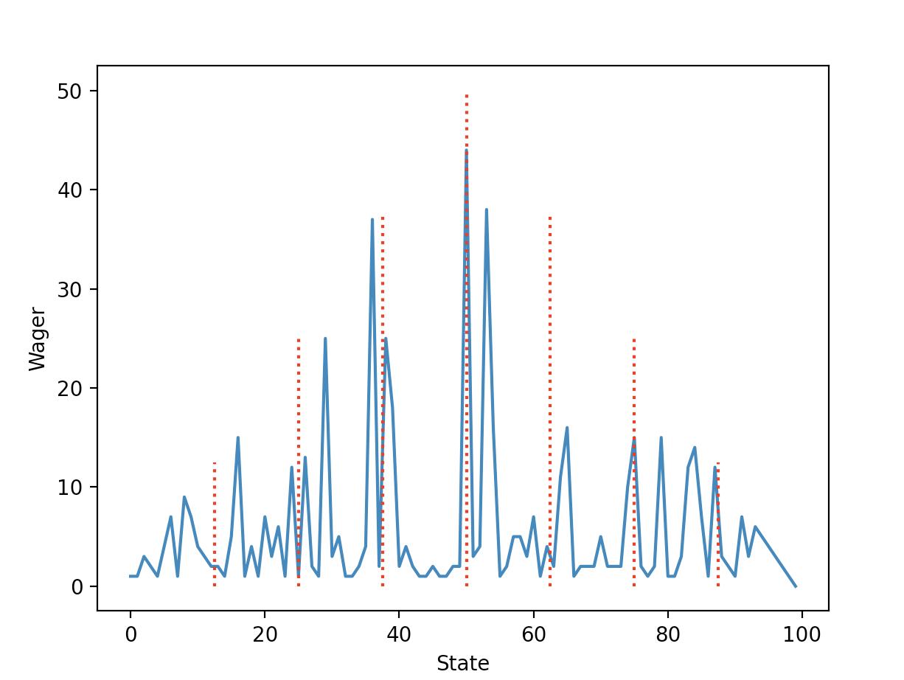

# General Purpose RL System 🤖

This project was part of the Artificial Intelligence Programming (IT3105) course at NTNU spring 2022. The aim of this project was to build a general purpose Actor-Critic Model (ACM) for Reinforcement Learning, applied it to three different problems: pole balancing, Towers of Hanoi, and the gambler.

## System Overview

The system consists of an actor that interacts with an environment (called SimWorlds). The actor stands for the core RL learning, while the environment houses everything else like maintaining the current state, provide the agent with current and successor (child) states, giving rewards based on state transitions and determining if the agent is in a end state. The actor consists of an actor-critic model. When deciding
upon the next action to take from game state s, the actor may consult the critic to get the values of all child
states of s. Through learning, the critic will have developed a thorough set of associations between states
and values (these can be represented in a table or in a neural net), and these will form the basis of the actor’s decision. 

This project will use on-policy RL, meaning that the policy used for searching through state space during each problem-solving episode (a.k.a. the behavior policy) is also the policy that the system is trying to learn/improve (a.k.a. the target policy). Hence, search behavior should change throughout the run (as the policy improves), and lead to an increased number of efficiently-solved problem scenarios (a.k.a. episodes) toward the end of the run.

A high-level view of the system is shown below:

## Problems

### Pole Balancing

As depicted in the figure below, the pole-balancing problem involves a pivoting pole on top of a moveable cart. Using a bang-bang force (i.e. one with a few simple, discrete options such as 10 Newtons applied to the left or right of the cart), the controller affects the cart’s horizontal motion, which then alters the pole’s vertical angle (θ). The goal is to keep the pole balanced for a target number of timesteps (e.g. 300): the absolute value of the pole’s vertical angle stays within a tight, pre-defined range (e.g. [-.21, .21] radians).

#### Results ✅

The following plot shows the number of steps during each episode of a run of the generic actor-critic algorithm on the pole balancing sim world with 200 episodes and 300 max-steps and a table-based critic:

As seen in the plot, the number of steps in the beginning of the run is low, meaning that the actor fails to balance the pole after a few steps. However after some episodes (and learning) it consistently manages to balance the pole for 300 steps! The plot below shows the angle of the pole during a successful run:

### Towers of Hanoi

This problem begins with all discs stacked on a single peg with the larger discs on the bottom, smaller discs on the top, and no pair of adjacent discs where a larger disc sits atop a disc smaller than itself. The goal is then to move the entire disc pyramid to a different peg, but only one disc at a time. On any given move, only the top disc of a peg can move, and only to a peg that is empty or where it will be smaller than the top disc currently on that peg. Optimal solutions involve the fewest number of moves. For example, the 3-peg, 4-disc problem requires a minimum of 15 moves.

#### Results ✅

The following plot shows the number of steps during each episode of a run of the generic actor-critic algorithm on the Towers of Hanoi sim world with 100 episodes, 3 pegs, 4 discs, and a table-based critic:

As seen in the plot, the number of steps in the beginning of the run is high, meaning that the actor uses a lot of steps to solve the problem. However after some episodes (and learning) it consistently manages to solve the puzzle in around 15 steps (which is the optimal solution)! The GIF below shows how the agent solves the problem with 15 moves:

### The Gambler

This resembles a random-walk but with variable step lengths dictated by explicit control decisions (i.e. wagers) performed by the gambling agent. Each of the gambler’s episodes begins with a randomly-chosen number of monetary units between 1 and 99. On each move, the agent bets U units on the toss of a biased coin (with a win probability of *p_w*). If the agent wins the toss, it gains U units: otherwise it loses them. The gambler’s goal is to reach 100 units, a victory, while dropping to 0 units constitutes failure. On each move, the gambler can bet no more units than it has and no more units than needed to reach 100. For example, if sitting at either 3 or 97, the gambler’s maximum bet is the same: three. In all states, the minimum bet is one.

The true optimal strategy is shown below:

#### Results ✅

The following plot shows the agents strategy (how much to wager, y-axis, in different states, x-axis) after a run of the generic actor-critic algorithm on the Gambler sim world with 100 episodes, *p_w*=0.6, and a table-based critic:

The plot shows some resemblance to the optimal strategy.

## Installation 📦

To install the required packages, use the following command: `pip install -r requirements.txt`

## Running agent on a problem

To train an agent on a problem with the default parameters, run the main.py file: `python main.py <sim_world> <ann (optional)>`.

<sim_world> can have the following values:
  * `pbsw`: Pole Balancing Sim World
  * `tohsw`: Towers of Hanoi Sim World
  * `gsw`: The Gambler Sim World

The critic is table-based by default. To use a ANN based critic, add `ann` as a second argument.

For example, to run a model on the Towers of Hanoi problem with an ANN based critic, run `python main.py tohsw ann`

The parameters of the sim worlds can be changed in the `main()` method in the `main.py` class.

## Future work 🚀

Future work on this project could include:
* **Adding animation for Pole Balancing sim world**: It would be nice to visualize how the agent solves this problem (similar to how solutions to Towers of Hanoi are visualized), rather than just a graph of the pole angle over time.
* **Optimizing code**: Not a lot of time has been used on optimizing the code, and this could be useful as some runs tend to take several minutes.
* **Create other sim worlds**: It could be interesting to train an agent to solve other puzzles/games!

